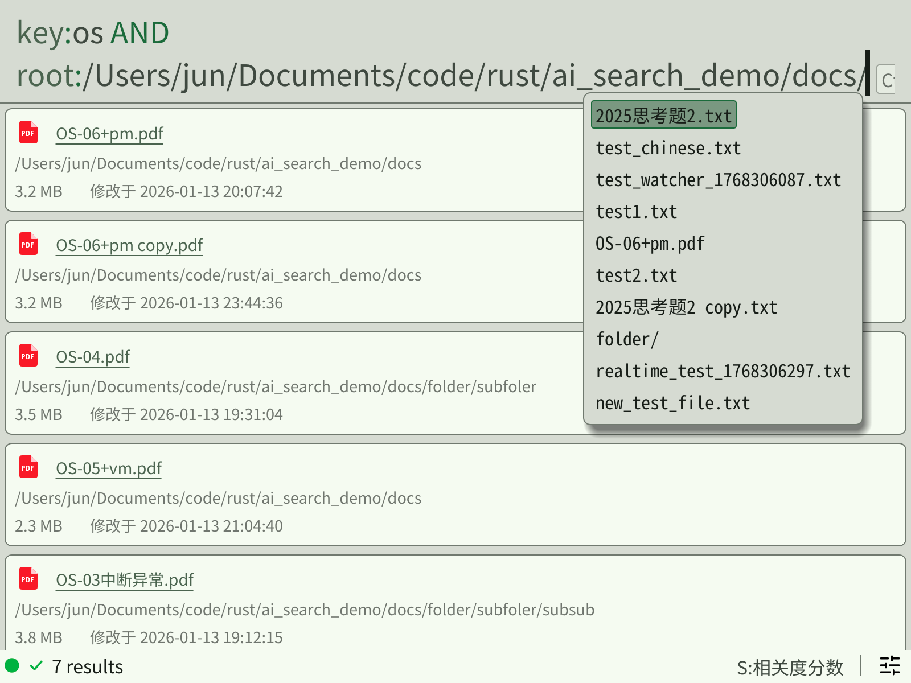
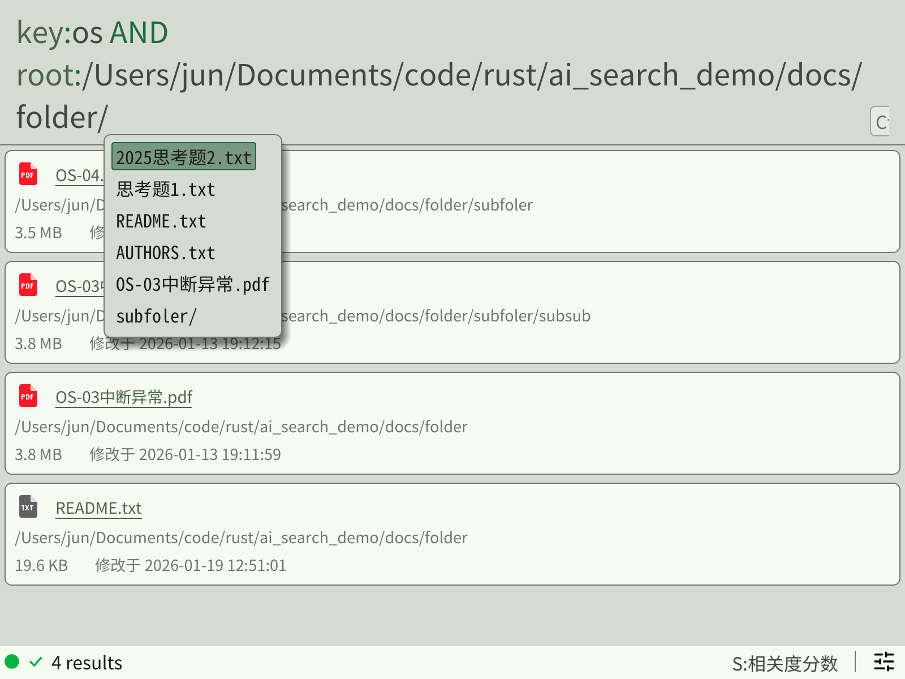

# Unnamed - 智能文件搜索引擎

[DeepWiki](https://deepwiki.com/UCAS-Modern-Operating-System-Group-5/unnamed/1-overview)

一个基于 Rust 构建的智能文件搜索系统，结合了传统全文搜索（Tantivy）和 AI 语义搜索（BERT）能力，提供高效的本地文件索引和检索功能。

## ✨ 主要特性

- 🔍 **全文搜索**: 基于 Tantivy 倒排索引，支持中文分词（jieba）
- 🧠 **AI 语义搜索**: 使用 BERT 模型进行关键词提取和语义理解
- 📁 **实时文件监控**: 使用 notify 库实现增量索引
- 🚀 **高性能 RPC**: 基于 tarpc 框架，使用 Unix Domain Socket 通信
- 🖥️ **跨平台 GUI**: 基于 egui 的图形界面客户端
- 📦 **多格式支持**: 支持 TXT、PDF、DOCX、Markdown 等文件格式的文本提取

---

## 效果展示

### 自然语言搜索

使用 AI 语义理解进行智能搜索：


### 规则搜索

支持精确匹配、Glob 模式、文件过滤等高级语法：



### 规则搜索（筛选 + 自动补全）

支持时间、大小过滤和智能补全：



---

## 🚀 快速开始

### 安装依赖

确保已安装 Rust 工具链（推荐使用 rustup）。

### 运行服务器

```bash
# 启动搜索服务
cargo run -- serve

# 或者先建立索引
cargo run -- index /path/to/documents
```

### 运行 GUI 客户端

```bash
cargo run -p gui
```

### 运行测试客户端

```bash
cargo run -p server --example interactive_client
cargo run -p server --example test_client
```

---

## 📋 命令参考

| 命令 | 说明 |
|------|------|
| `cargo run -- serve` | 启动 RPC 搜索服务 |
| `cargo run -- index <path>` | 对指定目录建立索引 |
| `cargo run -- clear-cache` | 清除缓存数据 |
| `cargo run -p gui` | 启动 GUI 客户端 |

### 使用 Just（可选）

如果安装了 [just](https://github.com/casey/just)：

```bash
just              # 默认命令
just run -- serve # 运行服务器
```

---

## 🔧 跨平台编译

使用 [cargo-zigbuild](https://github.com/rust-cross/cargo-zigbuild) 进行交叉编译（推荐）：

```bash
# 编译到 RISC-V 64 位
cargo zigbuild --release --target riscv64gc-unknown-linux-gnu
```

或使用 [cross](https://github.com/cross-rs/cross)：

```bash
CROSS_CONTAINER_UID=0 CROSS_CONTAINER_GID=0 cross build --release --target riscv64gc-unknown-linux-gnu

# 或使用 just
just build-riscv
```
---

## RISC-V 性能测试

本项目已在 RISC-V 64 位平台上进行测试，以下是 CPU 占用情况：

### 基准状态（系统空闲）


### 仅运行 GUI 客户端


### Server 索引构建中


### Server 运行中（等待请求）


### Server + GUI 空闲状态


### Server + GUI 搜索中


---

### 📂 项目结构

```
unnamed/
├── apps/                      # 应用层（可执行程序）
│   ├── server/               # 搜索服务器 🖥️
│   └── gui/                  # GUI 客户端 🎨
├── crates/                   # 核心库（可复用）
│   ├── search-core/          # 搜索引擎核心 🔍
│   ├── rpc/                  # RPC 接口定义 📡
│   ├── query/                # 查询解析器 📝
│   └── config/               # 配置管理 ⚙️
└── docs/                     # 文档 📚
    ├── ARCHITECTURE.md       # 架构文档
    └── API_REFERENCE.md      # API 参考
```

---

## 📂 目录详解

### `apps/` - 应用程序

#### `apps/server/` - 搜索服务器
后台服务进程，负责文件索引和搜索请求处理。

| 文件/目录 | 说明 |
|----------|------|
| `src/main.rs` | 入口：CLI 解析 + 命令分发 |
| `src/cli.rs` | Clap 命令行定义 |
| `src/config.rs` | 配置加载（server.toml） |
| `src/session.rs` | 会话管理器（管理搜索会话） |
| `src/command/serve.rs` | `serve` 命令：启动 RPC 服务 |
| `src/command/index.rs` | `index` 命令：建立文件索引 |
| `src/command/clear_cache.rs` | `clear-cache` 命令：清除缓存 |
| `src/indexer/` | 索引辅助模块 |
| `examples/` | 示例客户端（`test_client.rs`, `interactive_client.rs`） |

#### `apps/gui/` - 图形界面客户端
基于 egui 框架的跨平台桌面客户端。

| 文件/目录 | 说明 |
|----------|------|
| `src/main.rs` | 入口：eframe 初始化 |
| `src/app/` | 应用逻辑（状态管理、命令处理） |
| `src/backend/` | 后端通信（服务器状态检测） |
| `src/component/` | UI 组件（搜索栏、状态栏） |
| `src/ui/` | UI 配置（主题、字体、图标） |
| `src/util/` | 工具函数（查询高亮、自动补全） |
| `assets/icons/` | 图标资源 |
| `assets/trans/` | 多语言翻译文件（en.ftl, zh-hans.ftl） |

---

### `crates/` - 核心库

#### `crates/search-core/` - 搜索引擎核心
项目的核心引擎，提供索引和搜索功能。

| 模块 | 说明 |
|------|------|
| `lib.rs` | 库入口，定义 `SearchEngine` 结构体 |
| `ai.rs` | BERT 模型封装（关键词提取） |
| `cache.rs` | sled KV 数据库缓存（Embedding 缓存） |
| `indexer.rs` | 索引构建与文件监控 |
| `search.rs` | 搜索执行逻辑 |
| `extract.rs` | 文本提取器（PDF/TXT） |
| `registry.rs` | 文件处理协调器 |
| `rpc_compat.rs` | RPC 类型适配层 |
| `models.rs` | 数据模型定义 |
| `config.rs` | 配置结构定义 |
| `schema/` | Tantivy 索引 Schema 构建 |

#### `crates/rpc/` - RPC 接口定义
定义客户端与服务器之间的通信协议。

| 模块 | 说明 |
|------|------|
| `lib.rs` | tarpc 服务 trait 定义 |
| `search.rs` | 搜索相关类型（`SearchRequest`, `SearchHit` 等） |

**API 特点**:
- 异步搜索 + Offset-based 分页
- 支持流式返回和无限滚动

#### `crates/query/` - 查询解析器
解析和验证用户查询语法。

| 模块 | 说明 |
|------|------|
| `lexer.rs` | 词法分析器（Token 化） |
| `parser.rs` | 语法解析器 |
| `validator/` | 查询验证器（时间、文件大小等） |

#### `crates/config/` - 配置管理
提供跨平台配置路径解析。

| 模块 | 说明 |
|------|------|
| `lib.rs` | 配置路径解析（基于 etcetera） |
| `constants.rs` | 应用常量（名称、域名等） |

---

### `docs/` - 文档

| 文件 | 说明 |
|------|------|
| `ARCHITECTURE.md` | 详细的项目架构文档（含时序图、依赖关系） |
| `API_REFERENCE.md` | RPC API 接口参考文档 |

---

## 🏗️ 技术栈

| 组件 | 技术选型 |
|------|---------|
| **全文搜索** | [Tantivy](https://github.com/quickwit-oss/tantivy) |
| **AI 推理** | [Candle](https://github.com/huggingface/candle) (BERT) |
| **KV 缓存** | [Sled](https://github.com/spacejam/sled) |
| **RPC 框架** | [tarpc](https://github.com/google/tarpc) |
| **文件监控** | [notify](https://github.com/notify-rs/notify) |
| **GUI 框架** | [egui](https://github.com/emilk/egui) |
| **命令行** | [Clap](https://github.com/clap-rs/clap) |
| **异步运行时** | [Tokio](https://tokio.rs/) |


---

## 📖 开发指南

### 环境配置

安装 [EditorConfig](https://editorconfig.org/) 插件以保持代码风格一致。

### 项目依赖

```toml
# 主要 workspace 依赖
tokio = "1.48.0"      # 异步运行时
serde = "1.0"         # 序列化
tarpc = "0.37"        # RPC 框架
tantivy              # 全文搜索（通过 search-core）
```

### 配置文件

服务器配置示例见 `server.toml.example`。

---

## 📚 学习资源

- Google's [Comprehensive Rust](https://github.com/google/comprehensive-rust)
- [Rust Design Patterns](https://rust-unofficial.github.io/patterns/)

---


### 许可证

本项目采用 GNU General Public License v3 (GPLv3) 许可证。详见 [LICENSE](LICENSE) 文件。

---

## CONTRIBUTE

欢迎提交 Issue 和 Pull Request！
