# Unnamed 项目架构文档

本文档详细描述项目的代码组织、模块依赖关系和核心架构。

---

## 📁 项目目录结构

```text
unnamed/
├── apps/                      # 应用层（可执行程序）
│   ├── server/               # 搜索服务器
│   │   ├── src/
│   │   │   ├── main.rs       # 入口：CLI 解析 + 命令分发
│   │   │   ├── cli.rs        # Clap 命令行定义
│   │   │   ├── config.rs     # 配置加载（server.toml）
│   │   │   ├── session.rs    # 会话管理器
│   │   │   ├── command/      # 命令实现
│   │   │   │   ├── mod.rs    # Command trait 定义
│   │   │   │   ├── serve.rs  # serve 命令：启动 RPC 服务
│   │   │   │   └── index.rs  # index 命令：建立索引
│   │   │   └── indexer/      # 索引辅助模块
│   │   └── examples/         # 示例客户端
│   │       ├── test_client.rs
│   │       └── interactive_client.rs
│   └── gui/                  # GUI 客户端（未完成）
│
├── crates/                   # 核心库（可复用）
│   ├── search-core/          # 搜索引擎核心
│   │   └── src/
│   │       ├── lib.rs        # 库入口 + SearchEngine 结构
│   │       ├── ai.rs         # BERT 模型封装
│   │       ├── cache.rs      # sled Embedding 缓存
│   │       ├── indexer.rs    # 索引构建与监控
│   │       ├── search.rs     # 搜索执行
│   │       ├── extract.rs    # 文本提取（PDF/TXT）
│   │       ├── registry.rs   # 文件处理协调器
│   │       ├── rpc_compat.rs # RPC 类型适配层
│   │       ├── models.rs     # 数据模型
│   │       └── config.rs     # 配置结构
│   ├── rpc/                  # RPC 接口定义
│   │   └── src/
│   │       ├── lib.rs        # tarpc 服务定义
│   │       └── search.rs     # 搜索相关类型
│   └── config/               # 配置管理
│
└── docs/                     # 文档
    ├── API_REFERENCE.md      # API 接口文档
    ├── ARCHITECTURE.md       # 本文档
    └── USAGE.md              # 使用指南
```

---

## 🏗️ 分层架构

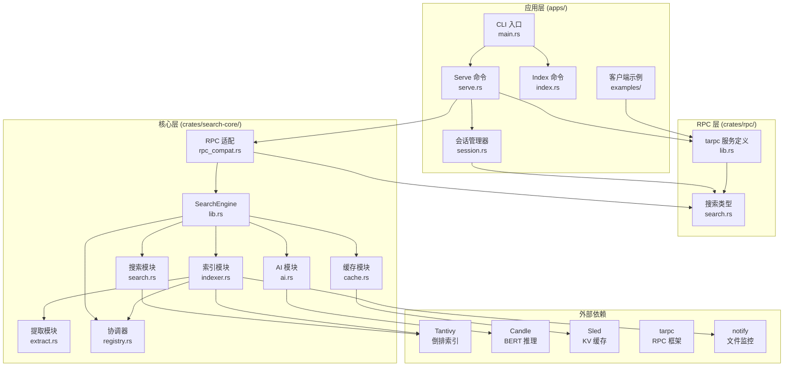

---

## 🔄 数据流架构

### 索引流程

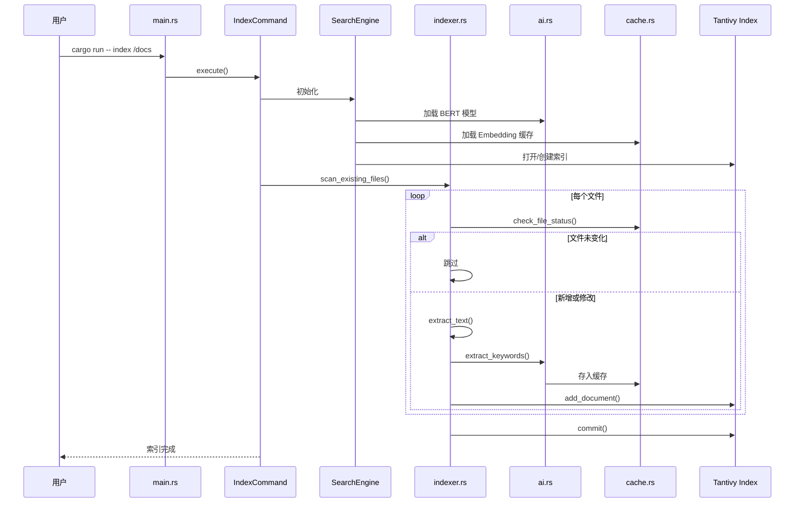

### 搜索流程（异步）

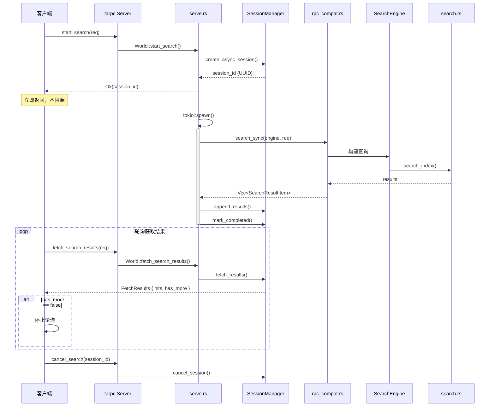

---

## 📦 模块依赖关系

### Crate 依赖图

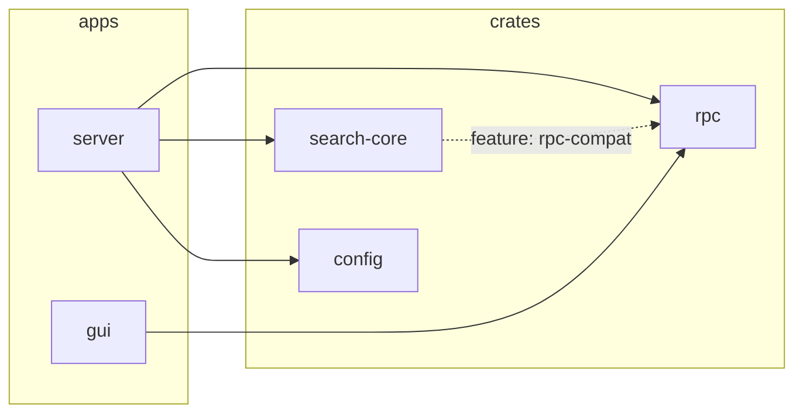

### search-core 内部依赖

```mermaid
graph TD
    subgraph "search-core/src/"
        Lib[lib.rs<br/>SearchEngine]
        AI[ai.rs<br/>BertModel]
        Cache[cache.rs<br/>EmbeddingCache]
        Indexer[indexer.rs<br/>索引构建]
        Search[search.rs<br/>搜索执行]
        Extract[extract.rs<br/>文本提取]
        Registry[registry.rs<br/>FileRegistry]
        Models[models.rs<br/>FileDoc]
        Config[config.rs<br/>配置结构]
        Compat[rpc_compat.rs<br/>RPC 适配]
    end

    Lib --> AI
    Lib --> Cache
    Lib --> Indexer
    Lib --> Search
    Lib --> Registry
    Lib --> Config
    Lib --> Models

    Indexer --> Extract
    Indexer --> Registry
    Indexer --> Cache
    Indexer --> AI

    Search --> AI

    Compat --> Lib
    Compat --> Search
```

### server 内部依赖

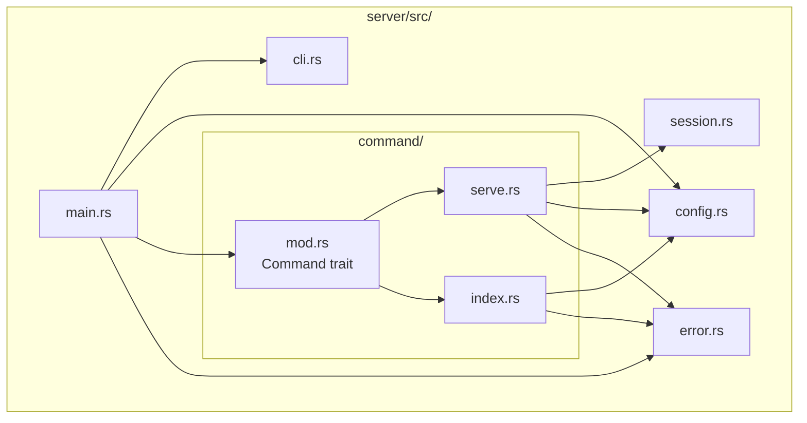

---

## 🔧 核心组件详解

### 1. SearchEngine (`search-core/src/lib.rs`)

搜索引擎的统一入口，聚合所有核心组件：

```rust
pub struct SearchEngine {
    pub index: tantivy::Index,       // Tantivy 索引实例
    pub schema: tantivy::Schema,     // 索引 Schema
    pub reader: tantivy::IndexReader,// 索引读取器
    pub bert: BertModel,             // BERT 模型
    pub cache: EmbeddingCache,       // Embedding 缓存
    pub registry: FileRegistry,      // 文件处理协调器
    pub config: SearchConfig,        // 搜索配置
}
```

**职责**:
- 初始化所有子系统
- 提供统一的搜索接口
- 管理资源生命周期

### 2. SessionManager (`server/src/session.rs`)

管理搜索会话，支持两种模式：

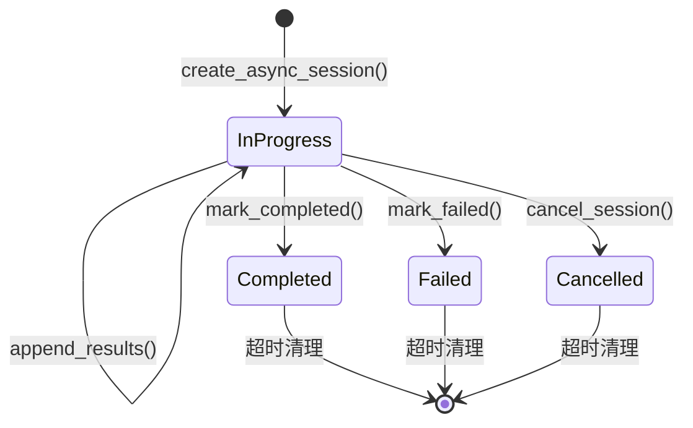

**API**:
| 方法 | 说明 |
|------|------|
| `create_session(hits)` | 同步模式：直接传入所有结果 |
| `create_async_session()` | 异步模式：创建空会话 |
| `append_results(id, hits)` | 追加结果（异步模式） |
| `mark_completed(id)` | 标记完成 |
| `fetch_results(id, offset, limit)` | 获取结果（offset-based） |
| `get_page(id, page, size)` | 获取分页（page-based） |
| `cancel_session(id)` | 取消会话 |

### 3. rpc_compat (`search-core/src/rpc_compat.rs`)

RPC 类型适配层，桥接 `rpc` crate 和 `search-core`：

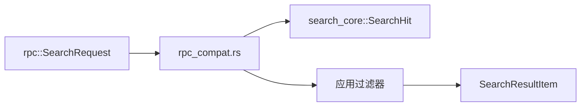

**关键函数**:
```rust
// 同步搜索（内部调用 Tantivy）
pub fn search_sync(engine: &SearchEngine, req: &RpcSearchRequest) 
    -> Result<Vec<SearchResultItem>, String>

// 应用 root_directories 过滤
filtered.retain(|item| {
    req.root_directories.iter().any(|root| {
        item.path.starts_with(root)
    })
});
```

### 4. FileRegistry (`search-core/src/registry.rs`)

防止扫描和监听线程重复处理同一文件：

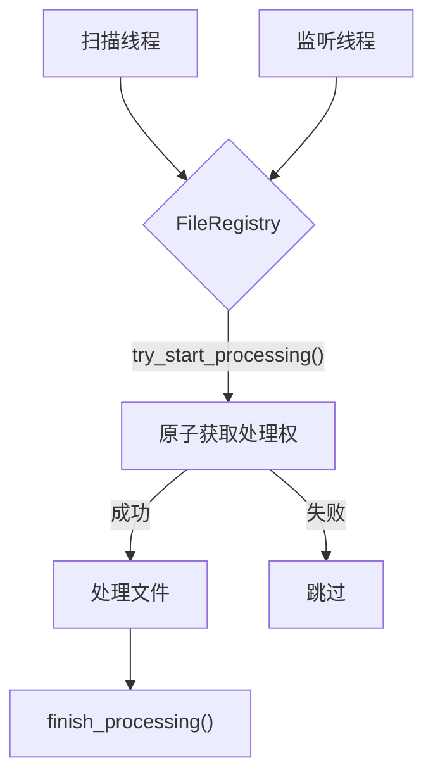

### 5. EmbeddingCache (`search-core/src/cache.rs`)

基于 sled 的双重缓存：

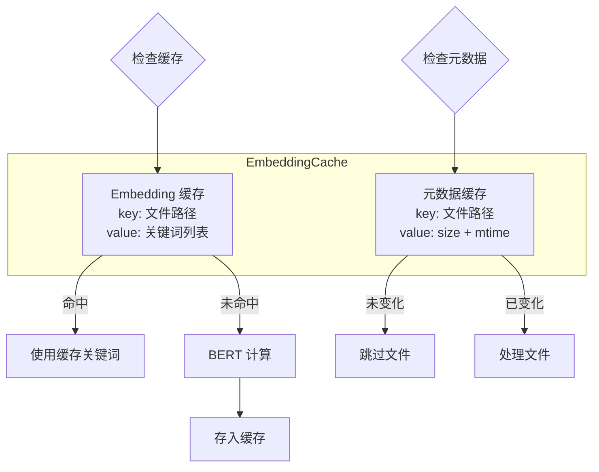

---

## 🌐 RPC 服务定义

```rust
#[tarpc::service]
pub trait World {
    // 健康检查
    async fn ping() -> String;

    // ===== 新 API（异步流式）=====
    async fn start_search_async(req: SearchRequest) -> StartSearchResult;
    async fn fetch_results(session_id: usize, offset: usize, limit: usize) -> Option<FetchResults>;
    async fn cancel_search(session_id: usize) -> bool;

    // ===== 旧 API（同步分页）=====
    async fn start_search(req: SearchRequest) -> SearchResult;
    async fn get_results_page(session_id: usize, page: usize, page_size: usize) -> Option<PagedResults>;
}
```

### 类型关系

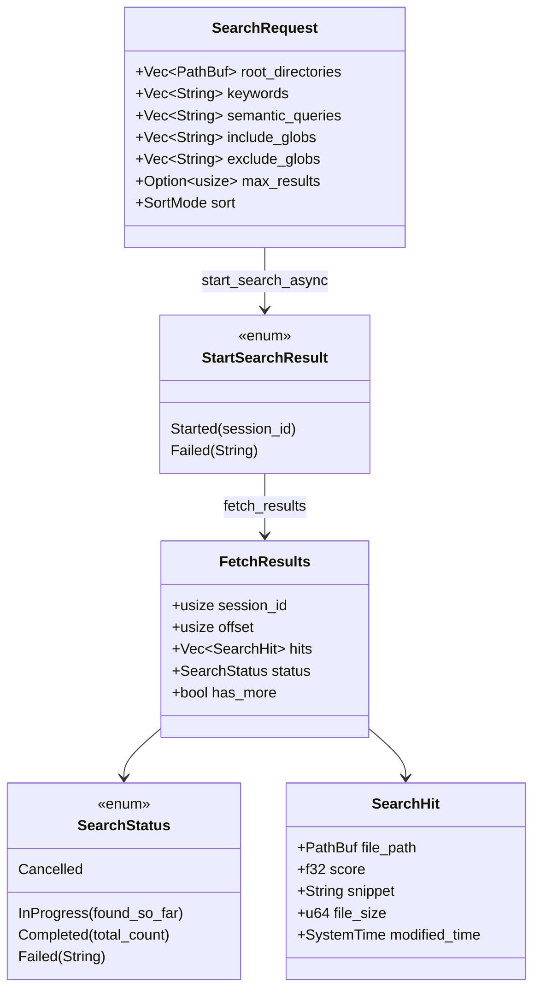

---

## 🔀 新旧 API 对比

| 特性 | 新 API (Offset-based) | 旧 API (Page-based) |
|------|----------------------|---------------------|
| 启动方法 | `start_search_async()` | `start_search()` |
| 返回时机 | 立即返回 | 等待搜索完成 |
| 获取结果 | `fetch_results(offset, limit)` | `get_results_page(page, size)` |
| 是否知道总数 | 搜索完成后才知道 | 启动时就知道 |
| 适用场景 | 流式/无限滚动/大数据集 | 传统分页/小数据集 |
| 会话状态 | InProgress → Completed | 直接 Completed |

---

## 🚀 启动流程

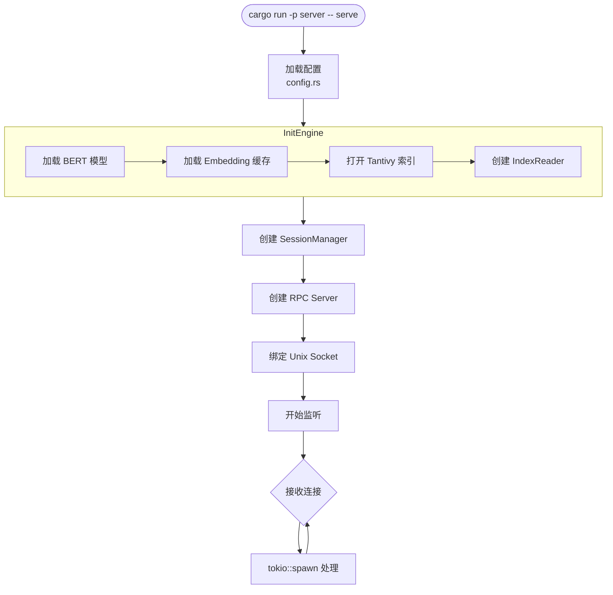

---

## 📊 技术栈总结

| 层级 | 组件 | 技术 | 用途 |
|------|------|------|------|
| **应用层** | server | clap + tokio | CLI + 异步运行时 |
| **RPC 层** | rpc | tarpc + bincode | 高性能 RPC |
| **搜索层** | search-core | tantivy + tantivy-jieba | 倒排索引 + 中文分词 |
| **AI 层** | ai.rs | candle | BERT 推理 |
| **缓存层** | cache.rs | sled + bincode | 嵌入式 KV |
| **监控层** | indexer.rs | notify | 文件系统事件 |
| **提取层** | extract.rs | pdf-extract | PDF 文本提取 |

---

## 📝 扩展指南

### 添加新的 RPC 方法

1. **定义接口** (`crates/rpc/src/lib.rs`):
```rust
#[tarpc::service]
pub trait World {
    // 添加新方法
    async fn new_method(param: Type) -> ReturnType;
}
```

2. **实现接口** (`apps/server/src/command/serve.rs`):
```rust
impl World for Server {
    async fn new_method(self, _c: Context, param: Type) -> ReturnType {
        // 实现逻辑
    }
}
```

### 添加新的搜索过滤器

1. **扩展 SearchRequest** (`crates/rpc/src/search.rs`):
```rust
pub struct SearchRequest {
    pub new_filter: Option<NewFilterType>,
    // ...
}
```

2. **实现过滤** (`crates/search-core/src/rpc_compat.rs`):
```rust
if let Some(filter) = &req.new_filter {
    filtered.retain(|item| apply_filter(item, filter));
}
```

---

**文档版本**: 1.0  
**最后更新**: 2026-01-12
